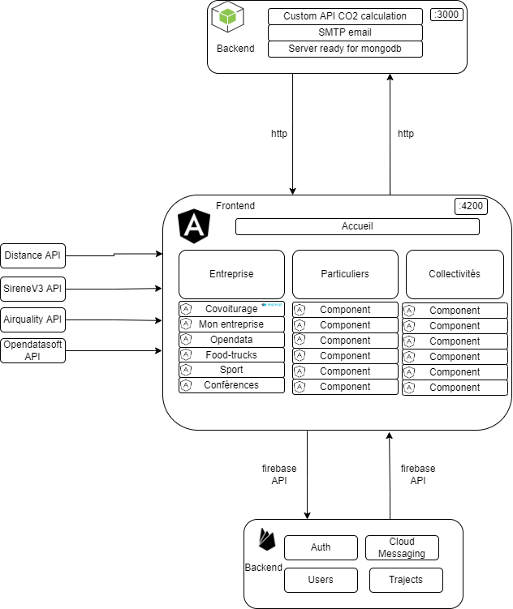

# website_dev

This website is running with angular a web framework using Typescript and an Express server that does the job of the backend.

Some formations are available here:  
- [beginner](https://www.youtube.com/watch?v=AAu8bjj6-UI)
- [angular-material](https://www.youtube.com/watch?v=jUfEn032IL8)
- [express integration](https://www.youtube.com/watch?v=dT1ID4q57fs&t=468s)
- [spinner](https://hackafro.github.io/angular-epic-spinners/)

## Collaboration
To collaborate on this project please request access to the owner. 
Please create your branch before collaborating on this project. 
It's can be done with: `git checkout -b "MyBranch"` 

## Installation

Install node: [here](https://nodejs.org/en/download/)

Verify your installation:
`npm --version`

Install angular: `npm install -g @angular/cli`  

These following steps have to be executed in two differents terminals  

> ## angular app
> 
> **Lines to run:**  
>- Go to the app directory: `cd IDeA`  
>
> - Install dependencies: `npm install`  
>
> - Run the app in localhost: `ng serve` 

>## express app 
>
> **Lines to run:**  
> - Go to the app directory: `cd backend`  
> - Install dependencies: `npm install`  
> - Run the app in localhost: `nodemon --exec npm start app.js` 
> *If nodemon is not install ->`npm i nodemon -g`*  

*When all these steps are done just launch you web browser with this access:*  
Access to localhost: [here](http://localhost:4200/)

## Architecture of the website

### Explanation 

>The Angular app is the main part of the website, it is composed of differents components that will display the differents pages and routes. This app run on port 4200 when you are using localhost.
>The main app need a backend storage to store the user, trajects and also manage the authentification. This is why we are using firebase which is an easy way to manage all these things. 
>To perform some calculation and to fetch some data we are using some APIs:
>- Opendatasoft -> provide us some data like sireneV3 and air quality, sireneV3 is used in the register part to assign a user to a particular entreprise, in a delimited area.
>- Distance APIs -> provide us the distance between two points, the geolocation of an address and also the geolocation of the user. 
>- Node Express server -> This server is running on port 3000, the Angular app will communicate with it trough CORS policy. On this server there is only the CO2 calculation that we have created and also an SMTP protocol ready to use if you want to use it. It was necessary for us to have this backend for future developpement like using a mongodb database that will perform CRUD operations on this server instead of firebase.

## Futur Developpement
>To avoid firebase pricing limitation it will be necessary to change to another similar database like mongodb. This is why we have create a mongodb pod on the minikube cluster.
>All the architecture of the website has been created, including routing for differents parts of the app (Particuliers, Collectivités, Entreprise...) 
>To add some new features to these parts you just need to add components on them and create the route corresponding in the submodule you want.

## Useful links
>Some useful packages and ressources that we are using in our app:
> - [angular-material](https://material.angular.io/): an angular library that provide reusable components
> - [iconscout](https://iconscout.com/): reusable icons, svg to beautify the app.
> - [opendatasoft v1](https://public.opendatasoft.com/explore/?sort=modified): Opendata source used in the app
> - [opendatasoft v2](https://data.opendatasoft.com/api/v2/console): V2 of the Opendata with more data but an API key is needed.
> - [kepler gl](https://kepler.gl/): Our map provider, very useful and simple.
> - [firebase](https://firebase.google.com/): Database created by google.
> - [kubernetes](https://kubernetes.io/): Container manager created by google.
> - [docker](https://www.docker.com/): Create containers and images
> - [deploy-repository](https://github.com/IDeAmiage/website-deploy) The github repository for the deploy part.

## build the app
>
> **Lines to run:**  
> - build the app: `ng build`  
> - Copy and paste the /dist directory to the [deploy-repository](https://github.com/IDeAmiage/website-deploy)  
> - Update the deploy repository: `git add . && git commit -m "[NEW] my version" && git push` 
> This process has not been automatise because of lack of time.

## generate the documentation
>
> **Lines to run:**  
> - Go to the app directory `cd IDeA`  
> - generate the doc: `compodoc -p tsconfig.doc.json`  
> - Lauch the index.html file  
